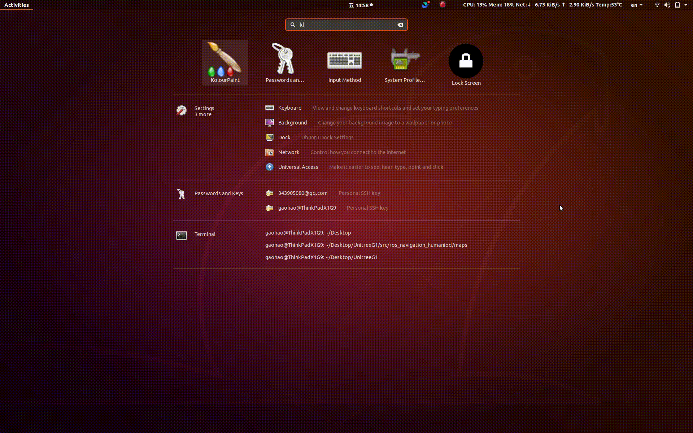

# ROS Navigation Humanoid

这个包用来实现人形机器人 ROS Navigation 控制与仿真，包中内置了一个 Unitree G1 演示demo以及一个rosbag数据包。

英文 [README.md](README_EN.md)

---

## 依赖与第三方工具

* ROS 包：
```bash
$ sudo apt-get install libpcl-dev ros-<distros>-nagivation ros-<distors>-tf ros-<distors>-sbpl ros-<distors>-visualization_msgs
```

* pgm地图修改工具：
```bash
$ sudo apt-get install kolourpaint
```

* Hinson-A 的点云转换功能包：
```bash
$ cd src
$ git clone git@github.com:Hinson-A/pcd2pgm_package.git
```

* 【可选】OpenCV-3

如果你不需要进行步态规划实验，可以不用安装OpenCV-3库，但在该仓库中的 `foot_planner.launch` 文件就无法运行。

------

## 更新日志

### 2025年04月14日
* 添加了在rviz中显示3D点云地图的功能；

### 2025年04月10日
* 添加了仿真与真机导航中在rviz上的重定位功能；
* 修改了README文件中的基础拼写错误；
* 添加了Unitree G1机器人步态仿真的功能；

### 2025年03月31日
* 添加rviz界面中发布目标位置并计算速度命令 `rviz_nav.launch`；

### 2025年03月06日
* 添加rviz界面中静态展示机器人模型 `static_display_without_map.launch`；
* 添加rviz界面中路径导航与自由控制仿真 `rviz_sim.launch`；
* 添加rviz界面中bag包回放 `bag_play.launch`；

------

## 编译

这里提供了两种编译方式，使用时按自己需求选择其中一种即可。

### devel 模式

```bash
$ catkin build
$ source devel/setup.bash
```

### install 模式

注意事项：
* 如果在调试完成后需要进行 install ，首先将 `build`、`devel`、`logs`、`.catkin_tools` 这几个文件夹删除后使用下面的的命令进行重新编译；
* 因为install方式会将资源文件复制到 install 目录下，如果对launch或者机器人描述文件进行了任何修改，都建议重新重新编译；

编译命令：
```bash
$ catkin config --install     # 首次编译时执行，后续编译不用重复执行
$ catkin build
$ source install/setup.bash
```

---

## 如何使用

使用该包中内置的 Unitree G1 机器人URDF文件以及 rosbag 可以进行静态展示与动态仿真模拟。`launch` 文件夹中提供了四个演示demo：

* `static_display.launch`：在rviz中静态展示机器人模型；
* `conv_pcd2pgm.launch`：将3D点云地图转换为pgm可以显示的栅格地图；
* `bag_play.launch`：回放数据包；
* `rviz_sim.launch`：在rviz中进行导航仿真；

---

### static_display.launch

该文件用来在rviz中静态展示机器人urdf模型，使用下面的命令运行：
```bash
$ roslaunch ros_navigation_humanoid static_display.launch
```

如果你想要使用自己的机器人模型文件，可以根据实际情况文件中的以下字段进行修改：
```xml
<arg name="pelvis_to_foot_heigth" default="0.8" />
<arg name="robot_name" default="g1_29dof_with_hand"/>
<param name="robot_description" textfile="$(find ros_navigation_humanoid)/robot_descriptions/unitree_g1/$(arg robot_name).urdf" />
<node pkg="tf" type="static_transform_publisher" name="pelvis_2_map" args="0 0 -$(arg pelvis_to_foot_heigth) 0 0 0 1 pelvis map 100" />
```


---

### conv_pcd2pgm.launch

该文件能将pcd点云转换成pgm栅格地图，依赖上文中提到的 `Hinson-A` 的点云转换功能包。

【注意】：该功能仅支持 `pcd` 格式的点云文件。

#### Step1. 将地图`pcd`点云文件移动到 `ros_navigation_humanoid/maps` 路径下

```bash
$ roscd ros_navigation_humanoid/
$ mv map.pcd maps/
```

#### Step2. 修改launch文件中的参数

根据需要对 `ros_navigation_humanoid/launch/conv_pcd2pgm.launch` 中的配置进行修改：

* `thre_z_min`: Z-轴最小的高度;
* `thre_z_max`: Z-轴最大的高度;
* `flag_pass_through`: 0 选取高度范围内的，１选取高度范围外的;
* `thre_radius`: 半径滤波的半径;
* `thres_point_count`: 半径滤波的要求点数个数;
* `map_resolution`: 存储的栅格map的分辨率;

#### Step3. 运行这个launch文件

```bash
$ roslaunch ros_navigation_humanoid conv_pcd2pgm.launch
```

#### Step4. 使用map_server将转换后的点云地图保存下来

```bash
$ roscd ros_navigation_humanoid/maps/
$ rosrun map_server map_saver
```

运行后会在当前文件夹下生成 `map.pgm` 和 `map.yaml` 文件。


#### Step5. 编辑地图

建议在完成地图转换后使用软件 `kolourpaint` 加载地图并编辑，主要针对障碍物和可通行区域修改，添加电子围栏以避免规划到未知区域上。



---

### rviz_nav.launch
这个文件在 `rviz` 界面中用 `move_base` 进行导航实测，通过 rviz 中的按钮 `2D Nav Goal` 发布 `/move_base_simple/goal` 话题以及规划器发布的 `/cmd_vel` 。

```bash
$ roslaunch ros_navigation_humanoid rviz_nav.launch
```

[待真机测试后补充git动图]


---

### rviz_sim.launch

这个文件在 `rviz` 界面中用 `move_base` 进行导航仿真，需要根据自己的需求对路径规划器进行配置，通过 rviz 中的按钮 `2D Nav Goal` 发布 `/move_base_simple/goal` 话题以及规划器发布的 `/cmd_vel` 并进行无损执行。

```bash
$ roslaunch ros_navigation_humanoid rviz_sim.launch
```


---

### bag_play.launch

这个文件用来实现将 rosbag 进行回放以查看机器人运动，要求 rosbag 包中的数据至少包含 `geometry_msgs/PoseStamped` 类型的 **定位** 信息，即机器人在空间中的位置和姿态。

```bash
$ roslaunch g1_ros1_nav bag_play.launch
```


---

### 【可选】foot_planner.launch

这个文件实现了机器人步态仿真的功能，如果想要运行则需要安装以下第三方package：
```bash
$ cd src
$ git clone https://github.com/ahornung/humanoid_msgs
```

然后拉取 `humanoid_navigation` 包，但这里只用到了这个包的其中两个部分，因此不需要将其全部放在编译空间中：

```bash
$ cd ..
$ git clone git@github.com:ROBOTIS-GIT/humanoid_navigation.git
$ mv humanoid_navigation/footstep_planner src
$ mv humanoid_navigation/gridmap_2d src
```

此时你的工作空间结构应该如下：

```bash
$ tree

├── src
│   ├── footstep_planner
│   ├── gridmap_2d
│   ├── humanoid_msgs
│   ├── pcd2pgm_package
│   └── ros_navigation_humanoid
```

编译整个工作空间：
```bash
$ catkin build
```

下面的命令二选一：
```bash
$ source install/setup.bash   # install模式
$ source devel/setup.bash     # devel模式
```

运行示例：
```bash
$ roslaunch ros_navigation_humanoid foot_planner.launch
```


---

## 后续工作

* 添加仿真环境中对机器人各个关节的控制与反馈；
* 整合点云转换并提供动态参数服务器；